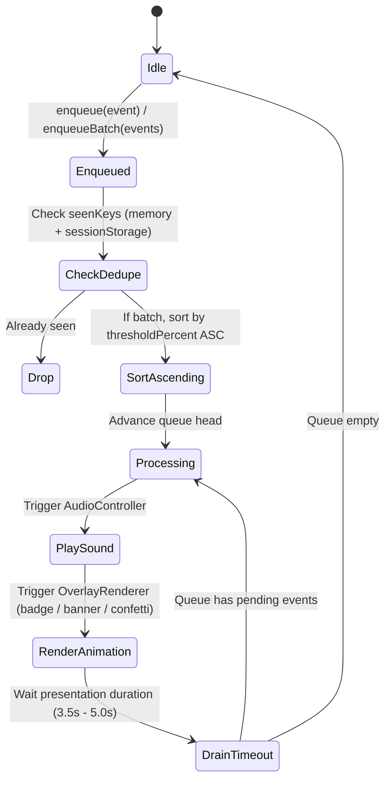

# OBS Presentation Queue

## Overview

The `PresentationQueue` manages the sequential, deterministic execution of milestone animations, donation alerts, and goal completion celebrations on the live stream.

When a large donation or multi-source burst causes progress to leap across multiple milestone thresholds (e.g. crossing 50%, 75%, and 100% in a single transaction), the queue guarantees that each milestone is presented in strictly ascending order without overlapping animations or clipped audio.

---

## Queue Lifecycle & Processing

---

## Deduplication Strategy

- **Milestone Deduplication Key**: `milestone:${goalId}:${epoch}:${thresholdPercent}` or `trigger:${triggerId}`
- **Alert Deduplication Key**: `alert:${alertId}`
- **Completion Deduplication Key**: `completion:${goalId}:${epoch}`

Keys are tracked in-memory using a `Set<string>` and mirrored to `sessionStorage` (bounded to the last 200 items). If a streamer reloads the OBS Browser Source mid-stream, previously triggered milestones in the current epoch are not spammed again.
